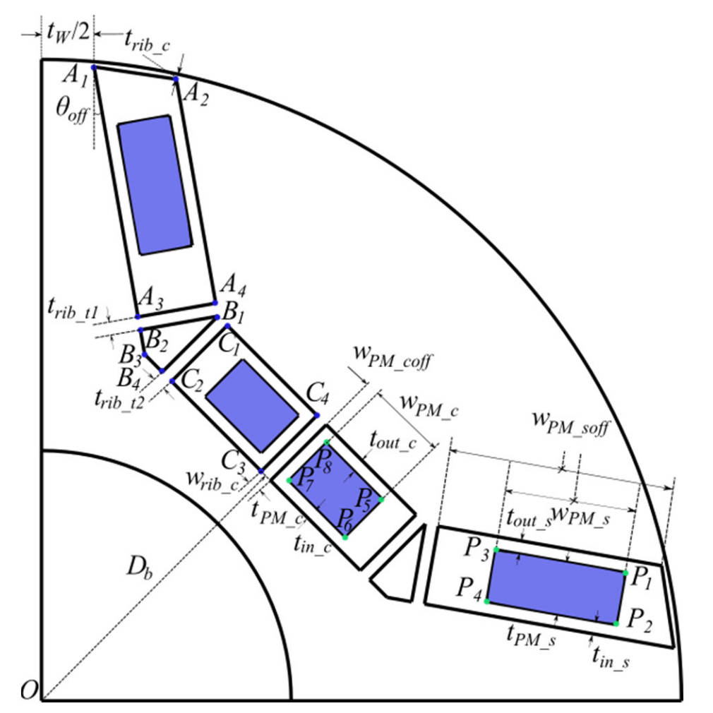
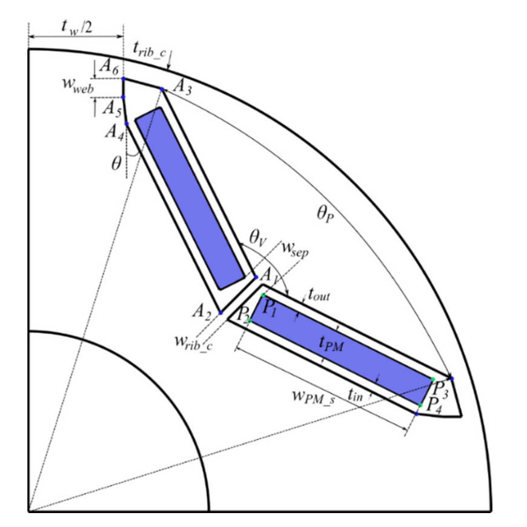
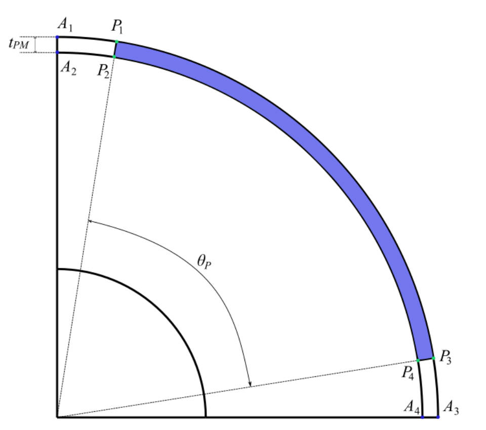

# 转子拓扑
## 同步磁阻电机

## 永磁电机
### 转子U型

- 由于内置式 $U$ 型转子需要适用于多层磁钢, 因此需磁钢、磁钢槽的坐标变量设置为数组, 并在计算前对所有坐标变量进行初始化。首先令转子 $q$ 轴位于 $x$ 轴, 坐标原点位于电机几何中心 $O$ , 建立笛卡尔坐标系。令 $x$ 轴为极坐标的角度坐标为 $0^{\circ}$ 的位置, 建立相应的极坐标系。内置式 $U$ 型转子参数化模型示意图如图 3-15 所示, 以下计算涉及到的点线均为转子 $d$ 轴与 $x$ 轴之间的半极模型上的点。
- 根据磁桥厚度 $t_{r i b_{-} c}$ (为叙述方便, 正文中、图中的变量名称与代码的变量命名不统一,而是在表 3-25 中将其一一对应), 得到 $A_{1}$ 点和 $A_{2}$ 点距 $O$ 点的距离  $|A_{1}O|=D_{r o} / 2-t_{r i b-c}$ , 其中 $D_{r o}$ 为转子外径。 $A_{1}$ 点的纵坐标为磁轭厚度 $t_{w}$ 的一半, 即 $y_{Al}=t_{w} / 2$ 。因此, $A_{1}$ 点的横坐标为:

$$
x_{A_{1}}=\sqrt{|A_{1} O|^{2}-y_{A_{1}}^{2}}
\tag{3-22}
$$

- 直线 $A_{1} A_{3}$ 与 $x$ 轴负方向的夹角为磁钢外层偏角 $\theta_{off}$ , 过 $A_{1}$ 点且斜率已知, 可以列出其直线方程为:

$$
y-y_{A 1}=(x-x_{A 1}) \cdot \tan (-\theta_{off})
\tag{3-23}
$$

- 将直线 $A_{1} A_{3}$ 向上平移外侧磁钢厚度 $t_{b d}$ 的距离, 得到直线 $A_{2} A_{4}$ , 列出其直线方程为:

$$
y-y_{A 1}=(x-x_{A 1}) \cdot \tan (-\theta_{off})+\frac{t_{b d}}{\cos (\theta_{off})}
\tag{3-24}
$$

- $A_{2}$  点所在圆的方程为:

$$
x^{2}+y^{2}=|A_{1} O|^{2}
\tag{3-25}
$$

- 联立式（3-23）与式（3-25），得到 $A_{2}$ 点的坐标：

$$
\begin{cases}
x_{A 2}=\frac{-b_{temp}+\sqrt{b_{temp}^{2}-4 \cdot a_{temp} \cdot c_{temp}}}{2 \cdot a_{temp}} \\
y_{A 2}=\sqrt{|A_{1} O|^{2}-x_{A 2}^{2}}
\end{cases}
\tag{3-26}
$$

- 其中, $a_{temp}$ 、$b_{temp}$ 、$c_{temp}$ 为联立后整理的二次方程的二次项、一次项、常数项系数：

$$
\begin{cases}
a_{temp}=1+[-\tan (\theta_{off})]^{2} \\
b_{temp}=2 \cdot[-\tan (\theta_{off})] \cdot[x_{A 1} \cdot \tan (\theta_{off})+\frac{t_{b d}}{\cos (\theta_{off})}+y_{A 1}] \\
c_{temp}=[x_{A 1} \cdot \tan (\theta_{off})+\frac{t_{ {bd }}}{\cos (\theta_{off})}+y_{A 1}]^{2}-|A_{1} O|^{2}
\end{cases}
\tag{3-27}
$$

- 设直线 $C_2 C_3$与转子 $d$ 轴的交点坐标为 $(x_{C2C3d}, y_{C2C3d})$，该点在极坐标下的坐标为：

$$
\begin{cases}
r_{C 2 C 3 d}=\frac{D_{b}}{2} \\
\alpha_{C 2 C 3 d}=\frac{\pi}{2p}
\end{cases}
\tag{3-28}
$$

- 式中, $D_{b}$ 磁钢槽内径, $p$ 为电机极对数。利用式（3-6）进行坐标变换得到 $(x_{C2C3d}, y_{C2C3d})$ 。将该点沿 $d$ 轴平移内侧磁钢槽厚度 $t_{b}$ 的距离, 得到直线 $C_{1} C_{4}$ 与转子 $d$ 轴的交点坐标为 $(x_{C1C4d}, {y}_{C1C4d})$ :

$$
\begin{cases}
x_{C 1 C 4 d}=x_{C 2 C 3 d}+t_{b} \cdot \cos (\frac{\pi}{2p}) \\
y_{C 1 C 4 d}=y_{C 2 C 3 d}+t_{b} \cdot \sin (\frac{\pi}{2p})
\end{cases}
\tag{3-29}
$$

- 直线 $B_{3} C_{3}$ 过 $(x_{C 2 C 3 d}, y_{C 2 C 3 d})$ 点且斜率已知, 可以列出直线 $B_{3} C_{3}$ 的方程:

$$
y-y_{C 2 C 3 d}=-\frac{x-x_{C 2 C 3 d}}{\tan (\frac{\pi}{2p})}
\tag{3-30}
$$

- 直线 $A_{1} A_{3}$ 与直线 $B_{3} C_{3}$ 相交于 $B_{3}$ 点, 联立式 (3-23) 与式 (3-30), 得到:

$$
\begin{cases}
x_{B 3}=\frac{y_{C 2 C 3 d}-y_{A 1}+\frac{x_{C 2 C 3 d}}{\tan (\frac{\pi}{2p})}-x_{A 1} \cdot \tan \theta_{off}}{-\tan \theta_{off}+\frac{1}{\tan (\frac{\pi}{2p})}} \\
y_{B 3}=y_{A 1}-(x_{B 3}-x_{A 1}) \cdot \tan \theta_{off}
\end{cases}
\tag{3-31}
$$

- 直线 $B_{1} C_{4}$ 过 $(x_{C 1 C 4 d}, y_{C 1 C 4 d})$ 点且斜率已知, 可以列出直线  $B_{1} C_{4}$ 的方程:

$$
y-y_{C 1 C 4 d}=-\frac{x-x_{C 1 C 4 d}}{\tan (\frac{\pi}{2p})}
\tag{3-32}
$$

- 直线 $A_{2} A_{4}$ 与直线 $B_{1} C_{4}$ 相交于 $B_{1}$ 点, 联立式 (3-24)、式 (3-26) 与式 (3-32), 得到:

$$
\begin{cases}
x_{B 1}=\frac{y_{C 1 C 4 d}-y_{A 2}+\frac{x_{C 1 C 4 d}}{\tan (\frac{\pi}{2p})}-x_{A 2} \cdot \tan \theta_{off}}{-\tan \theta_{off}+\frac{1}{\tan (\frac{\pi}{2p})}} \\
y_{B 1}=y_{A 2}-(x_{B 1}-x_{A 2}) \cdot \tan \theta_{off}
\end{cases}
\tag{3-33}
$$

- 直线 $B_{1} B_{4}$ 过 $B_{1}$ 点且斜率已知, 可以列出直线 $B_{1} B_{4}$ 的方程:

$$
y-y_{B_{1}}=(x-x_{B_{1}}) \cdot \tan (\frac{\pi}{2p})
\tag{3-34}
$$

- 直线 $B_{1} B_{4}$ 与直线 $B_{3} C_{3}$ 相交于 $B_{4}$ 点, 联立式 (3-30)、式  (3-34) , 得到:

$$
\begin{cases}
x_{B 4}=\frac{y_{C 2 C 3 d}-y_{B 1}+\frac{x_{C 2 C 3 d}}{\tan (\frac{\pi}{2p})}+x_{A 2} \cdot \tan \theta_{off}}{\tan \theta_{off}+\frac{1}{\tan (\frac{\pi}{2p})}} \\
y_{B 4}=y_{B 1}-(x_{B 4}-x_{B 1}) \cdot \tan (\frac{\pi}{2p})
\end{cases}
\tag{3-35}
$$

- 直线 $B_{1} B_{2}$ 过 $B_{1}$ 点且斜率已知, 可以列出直线 $B_{1} B_{2}$ 的方程:

$$
y-y_{B_{2}}=\frac{x-x_{B_{2}}}{\tan \theta_{off}}
\tag{3-36}
$$

- 直线 $B_{1} B_{2}$ 与直线 $A_{1} A_{3}$ 相交于  B_{2}  点, 联立式 (3-23)、式 (3-36), 得到:

$$
\begin{cases}
x_{B_{2}}=\frac{y_{A_{1}}-y_{B_{1}}+\frac{x_{B_{1}}}{\tan \theta_{off}}+x_{A_{1}} \cdot \tan \theta_{off}}{\tan \theta_{off}+\frac{1}{\tan \theta_{off}}} \\
y_{B_{2}}=y_{A_{1}}-(x_{B_{2}}-x_{A_{1}}) \cdot \tan \theta_{off}
\end{cases}
\tag{3-37}
$$

- 将 $B_{1}$ 点与 $B_{4}$ 点沿射线 $B_{4} C_{3}$ 方向平移内侧磁桥厚度 $t_{rib\_t2}$ 的距离, 得到 $C_{1}$、$C_{2}$ 点:

$$
\begin{cases}
x_{C 1}=x_{B 1}-t_{r i b_{-} t 2} \cdot \sin (\frac{\pi}{2p}) \\
y_{C 1}=y_{B 1}+t_{r_{i b-} t 2} \cdot \cos (\frac{\pi}{2p})
\end{cases} 
\tag{3-38}
$$

$$
\begin{cases}
x_{C 2}=x_{B 4}-t_{r_{i b_{-} t 2}} \cdot \sin (\frac{\pi}{2p}) \\
y_{C 2}=y_{B 4}+t_{r i b_{-} t 2} \cdot \cos (\frac{\pi}{2p})
\end{cases}
\tag{3-39}
$$

- 将转子 $d$ 轴所在直线沿射线 $B_{4} C_{3}$ 平移中间磁桥厚度  $w_{rib\_c}/2$  的距离, 可以列出该直线方程:

$$
y=x \cdot \tan (\frac{\pi}{2p})-\frac{w_{rib\_c}}{2 \sin (\frac{\pi}{2p})}
\tag{3-40}
$$

- 与直线 $B_{3} C_{3} $ 、直线 $B_{1} C_{4}$ 分别相交于  $C_{3}$、$C_{4}$ 点, 分别联立式（3-30）、式（3-40）与式（3-32）、式 (3-40), 得到:

$$
\begin{cases}
\ x_{C_{3}}=\frac{\frac{x_{C_{2} C_{3} d}}{\tan (\frac{\pi}{2p})}+y_{C_{2} C_{3} d}+\frac{w}{2 \sin (\frac{\pi}{2p})}}{\tan (\frac{\pi}{2p})+\frac{1}{\tan (\frac{\pi}{2p})}}\\
\ y_{C_{3}}=x_{C_{3}} \cdot \tan (\frac{\pi}{2p})-\frac{w}{2 \sin (\frac{\pi}{2p})} \\
\end{cases}
\tag{3-41}
$$

$$
\begin{cases}
\ x_{C_{4}}=\frac{\frac{x_{C_{1} C_{4} d}}{\tan (\frac{\pi}{2p})}+y_{C_{1} C_{4} d}+\frac{w}{2 \sin (\frac{\pi}{2p})}}{\tan (\frac{\pi}{2p})+\frac{1}{\tan (\frac{\pi}{2p})}}\\
\ y_{C_{3}}=x_{C_{4}} \cdot \tan (\frac{\pi}{2p})-\frac{w}{2 \sin (\frac{\pi}{2p})}\\
\end{cases}
\tag{3-42}
$$

- $A_{1} A_{2}$、$A_{2} A_{4}$、$A_{4} A_{3}$、$A_{3} A_{1}$、$B_{1} B_{2}$、$B_{2} A_{4}$、$B_{4} B_{3}$、$B_{3} B_{1}$、$C_{1} C_{2}$、$C_{2} C_{3}$、$C_{3} C_{4}$、$C_{4} C_{1}$ 为线段连接, 画出内外侧磁钢槽。

- 将 ${C}_{4}$ 点沿射线 ${C}_{4} C_{1}$ 方向平移内侧磁钢偏移 $w_{PM\_coff}$ 的距离, 再沿射线 ${C}_{4} {C}_{3}$ 方向平移内侧磁钢槽外侧间隙 $t_{out\_c}$ 的距离, 得到 $P_{8}$ 点:

$$
\begin{cases}
x_{P_{8}}=x_{C_{4}}+w_{PM\_c off} \cdot \sin (\frac{\pi}{2p})-t_{out\_c} \cdot \cos (\frac{\pi}{2p}) \\
y_{P_{8}}=y_{C_{4}}-w_{PM\_c off} \cdot \cos (\frac{\pi}{2p})-t_{out\_c} \cdot \sin (\frac{\pi}{2p})
\end{cases}
\tag{3-43}
$$

- 将 $P_{8}$  点沿射线 ${C}_{4} {C}_{3}$  方向平移内侧磁钢厚度 $t_{PM\_c}$ 的距离, 得到 $P_{7}$ 点:

$$
\begin{cases}
x_{P_{7}}=x_{P_{8}}-t_{PM\_c} \cdot \cos (\frac{\pi}{2p}) \\
y_{P_{7}}=y_{P_{8}}-t_{PM\_c} \cdot \sin (\frac{\pi}{2p})
\end{cases}
\tag{3-44}
$$

- 将 $P_{8}$  点沿射线 ${C}_{4} C_{1}$ 方向平移内侧磁钢长度 $w_{PM\_c}$ 的距离, 得到 $P_{5}$ 点:

$$
\begin{cases}
x_{P_{5}}=x_{P_{8}}+w_{PM\_c} \cdot \sin (\frac{\pi}{2p}) \\
y_{P_{5}}=y_{P_{8}}-w_{PM\_c} \cdot \cos (\frac{\pi}{2p})
\end{cases}
\tag{3-45}
$$

- 将 $P_{5}$ 点沿射线 ${C}_{4} {C}_{3}$  方向平移内侧磁钢厚度 $t_{PM\_c}$ 的距离, 得到 $P_{6}$ 点:

$$
\begin{cases}
x_{P_{6}}=x_{P_{5}}-t_{PM\_c} \cdot \cos (\frac{\pi}{2p}) \\
y_{P_{6}}=y_{P_{5}}-t_{PM\_c} \cdot \sin (\frac{\pi}{2p})
\end{cases}
\tag{3-46}
$$

- $P_{8} P_{7}$、$P_{7} P_{6}$、$P_{6} A_{5}$、$P_{8} P_{5}$ 为线段连接，画出内侧磁钢。
- 对于外侧磁钢，磁钢槽线段 $A_{2} A_{4}$ 与磁钢线段 $P_{1} P_{3}$ 二者的中点在直线 $A_{2} A_{4}$ 方向上的距离定义为外侧磁钢偏移 $w_{PM\_soff}$, 据此计算 $P_{1} P_{2} P_{3} P_{4}$ 的坐标。
- 线段 $P_{1} P_{3}$ 的中点 $P_{13}$ 由的线段 $A_{2} A_{4}$ 的中点沿射线 $A_{4} A_{3}$ 的方向平移外侧磁钢槽外侧间隙 $t_{out\_s}$ 的距离，再沿射线 $A_{4} A_{2}$ 的方向平移外侧磁钢偏移 $w_{PM\_soff}$ 的距离得到:

$$
\begin{cases}
x_{P_{13}}=\frac{x_{A_{4}}+x_{A_{2}}}{2}+w_{PM\_soff} \cdot \cos (\theta_{off})-t_{out\_s} \cdot \sin (\theta_{off}) \\
y_{P_{13}}=\frac{y_{A_{4}}+y_{A_{2}}}{2}-w_{PM\_soff} \cdot \sin (\theta_{off})-t_{out\_s} \cdot \cos (\theta_{off})
\end{cases}
\tag{3-47}
$$

- 线段 $P_{2} P_{4}$ 的中点 $P_{24}$ 由 $P_{13}$ 点沿射线 $A_{3} A_{4}$ 的方向平移外侧磁钢厚度 $t_{PM\_s}$ 的距离得到:

$$
\begin{cases}
x_{P_{24}}=x_{P_{13}}-\frac{t_{PM\_s}}{2} \cdot \sin (\theta_{off}) \\
y_{P_{24}}=y_{P_{13}}-\frac{t_{PM\_s}}{2} \cdot \cos (\theta_{off})
\end{cases}
\tag{3-48}
$$

- 由 $P_{13}$ 点分别沿射线 $P_{3} P_{1}$ 和射线 $P_{1} P_{3}$ 的方向平移外侧磁钢长度的一半 $w_{PM\_s} / 2$ 的距离，$P_{1}$ 点与 $P_{3}$ 点:

$$
\begin{cases}
x_{P_{1}}=x_{P_{13}}+\frac{w_{PM\_s}}{2} \cdot \cos (\theta_{off}) \\
y_{P_{1}}=y_{P_{13}}-\frac{w_{PM\_s}}{2} \cdot \sin (\theta_{off})
\end{cases}
\tag{3-49}
$$

$$
\begin{cases}
x_{P_{3}}=x_{P_{13}}-\frac{w_{PM\_s}}{2} \cdot \cos (\theta_{off}) \\
y_{P_{3}}=y_{P_{13}}+\frac{w_{PM\_s}}{2} \cdot \sin (\theta_{off})
\end{cases}
\tag{3-50}
$$

- $P_{1}$ 点与 $P_{3}$ 点沿射线 $A_{4} A_{3}$ 的方向平移外侧磁钢厚度 $t_{PM\_s}$ 的距离 $P_{2}$ 点与 $P_{4}$ 点：

$$
\begin{cases}
x_{P_{2}}=x_{P_{1}}-\frac{t_{PM\_s}}{2} \cdot \sin (\theta_{off}) \\
y_{P_{2}}=y_{P_{1}}-\frac{t_{PM\_s}}{2} \cdot \cos (\theta_{off})
\end{cases}
\tag{3-51}
$$

$$
\begin{cases}
x_{P_{4}}=x_{P_{3}}-\frac{t_{PM\_s}}{2} \cdot \sin (\theta_{off}) \\
y_{P_{4}}=y_{P_{3}}-\frac{t_{PM\_s}}{2} \cdot \cos (\theta_{off})
\end{cases}
\tag{3-52}
$$

- $P_{1} P_{2}$、$P_{2} P_{4}$、$P_{4} A_{3}$、$P_{3} P_{1}$ 为线段连接，画出外侧磁钢。对各个封闭区域添加相应的材料，得到半极模型。以转子 $d$ 轴为对称轴, 镜像出另一半极, 并对侧边界添加反周期边界条件,得到内置式 $$ 型转子单极模型。
- 创建一对极模型时，除磁钢材料外均可利用镜像功能得到另一极，对于磁钢材料，需将磁钢的充磁方向反向，对侧边界添加周期边界条件，得到内置式 $U$ 型转子一对极模型。全模型无需画出侧边界，只需将一对极的磁钢与磁钢槽按极对数进行镜像，画出转子内外径整圆，得到内置式 $U$ 型转子全模型。

图 3-15 内置式 U 型转子参数化模型示意图

---

表3-25内置式U型转子变量名称对应表

| 参数名称 | 变量名称 | 图中标示 |
| :---: | :---: | :---: |
| 转子外径 | RotorOuterDiameter | $D_{ro}$ |
| 转子U型磁钢槽内径 | RotorMagnetUShapeInnerDiameter | $D_b$ |
| 转子U型磁桥厚度 | RotorMagnetUShapeBridgeThickness | $t_{rib_c}$ |
| 转子U型磁轭厚度 | RotorMagnetUShapeWebThickness | $t_w$ |
| 转子U型磁钢外层偏角 | RotorMagnetOuterAngleOffset | $\theta_{off}$ |
| 转子U型外侧磁钢厚度 | RotorMagnetOuterSlotThickness | $t_{PM\_s}$ |
| 转子U型外侧磁钢长度 | RotorMagnetOuterLength | $W_{PM\_s}$ |
| 转子U型外侧磁钢偏移 | RotorMagnetOuterOffset | $W_{PM\_soff}$ |
| 转子U型外侧磁钢槽内侧间隙 | RotorMagnetOuterInnerClearance | $t_{in\_s}$ |
| 转子U型外侧磁钢槽外侧间隙 | RotorMagnetOuterOuterClearance | $t_{out\_s}$ |
| 转子U型外侧磁桥厚度 | RotorMagnetOuterBridgeThickness | $t_{rib\_tl}$ |
| 转子U型内侧磁钢厚度 | RotorMagnetInnerSlotThickness | $t_{PM\_c}$ |
| 转子U型内侧磁钢长度 | RotorMagnetInnerLength | $W_{PM\_c}$ |
| 转子U型内侧磁钢偏移 | RotorMagnetInnerOffset | $W_{PM\_coff}$ |
| 转子U型内侧磁钢槽内侧间隙 | RotorMagnetInnerInnerClearance | $t_{in\_c}$ |
| 转子U型内侧磁钢槽外侧间隙 | RotorMagnetInnerOuterClearance | $t_{out\_c}$ |
| 转子U型内侧磁桥厚度 | RotorMagnetInnerBridgeThickness | $t_{rib\_t2}$ |
| 转子U型中间磁桥厚度 | RotorMagnetCenterBridgeThickness | $W_{rib\_c}$ |

### 转子V型

- 由于内置式 $V$ 型转子需要适用于多层磁钢, 因此需磁钢、磁钢槽的坐标变量设置为数组, 并在计算前对所有坐标变量进行初始化。首先令转子 $q$ 轴位于 $x$ 轴, 坐标原点位于电机几何中心 $O$ , 建立笛卡尔坐标系。令  x  轴为极坐标的角度坐标为 $0^{\circ}$ 的位置, 建立相应的极坐标系。内置式 $V$ 型转子参数化模型示意图如图 3-19 所示, 以下计算涉及到的点线均为转子 $d$ 轴与 $x$ 轴之间的半极模型上的点。
- 根据磁桥厚度  $t_{rib\_c}$  (为叙述方便, 正文中、图中的变量名称与代码的变量命名不统一,而是在表 3-31 中将其一一对应), 得到  $A_{6}$  点和  $A_{3}$  点距 O 点的距离  $|A_{6}O|=D_{r o} / 2-t_{rib\_c}$ , 其中  $D_{r o}$  为转子外径。  $A_{6}$  点的纵坐标为磁轭厚度 $t_{w}$ 的一半, 即 $y_{A 6}=t_{w} / 2$。因此, $A_{6}$ 点的横坐标为:

$$
x_{A_{6}}=\sqrt{|A_{6} O|^{2}-y_{A_{6}}^{2}}
\tag{3-53}
$$

- 将 $A_{6}$ 点沿  x  轴负方向平移磁轭长度 $w_{w e b}$ 的距离, 得到 $A_{5}$ 点:

$$
\begin{cases}
x_{A_{5}}=x_{A_{6}}-w_{w e b} \\
y_{A_{5}}=y_{A_{6}}
\end{cases}
\tag{3-54}
$$

- 根据磁钢极弧角 $\theta_{p}$ (转换为机械角度) 推得极坐标下 $A_{3}$ 点:

$$
\begin{cases}
r_{A_{3}}=|A_{6} O| \\
\alpha_{A_{3}}=\frac{\pi}{2p}-\frac{\theta_{p}}{2}
\end{cases}
\tag{3-55}
$$

- 利用式（3-6）进行坐标变换得到 $(x_{A 3}, y_{A 3})$。
- 直线 $A_{1} A_{3}$ 过点 $A_{3}$ 且斜率利用 $\theta$ 可求, 列出其直线方程:

$$
y-y_{A_{3}}=-(x-x_{A_{3}}) \tan \theta
\tag{3-56}
$$

- 由转子 $d$ 轴沿几何垂直于 $d$ 轴的方向平移内磁桥厚度的一半 $w_{rib}\_c/2$ 的距离得到直线 $A_{1} A_{2}$,据此列出其直线方程:

$$
y=x \cdot \tan (\frac{\pi}{2p})-\frac{w_{rib\_c}}{2 \cos (\frac{\pi}{2p})}
\tag{3-57}
$$

- 直线 $A_{1} A_{3}$ 与直线 $A_{1} A_{2}$ 相交于 $A_{1}$ 点, 联立式 (3-56) 与式 (3-57) 得:

$$
\begin{cases}
x_{A_{1}}=\frac{x_{A_{3}} \cdot \tan \theta+y_{A_{3}}+\frac{w_{rib\_c}}{2 \cos (\frac{\pi}{2p})}}{\tan \theta+\tan (\frac{\pi}{2p})} \\
y_{A_{1}}=x_{A_{1}} \cdot \tan \theta-\frac{w_{rib\_c}}{2 \cos (\frac{\pi}{2p})}
\end{cases}
\tag{3-58}
$$

- 将 A1 点沿转子 d 轴负方向平移一段距离，该距离投影到直线 A1A3 的垂线上为磁钢槽厚度（磁钢厚度、磁钢内层与磁钢槽的间隙、磁钢外层与磁钢槽的间隙三者之和），因此，该距离为：

$$
|A_{1} A_{2}|=\frac{t_{PM\_s}+t_{ {in }}+t_{ {out }}}{\sin (\frac{\theta_{V}}{2})}
\tag{3-59}
$$

- 根据式（3-58）与式（3-59）及 $A_{1}$ 点与 $A_{2}$ 点的位置关系得 $A_{2}$ 点：

$$
\begin{cases}
x_{A_{2}}=x_{A 1}-|A_{1} A_{2}| \cdot \cos (\frac{\pi}{2p}) \\
y_{A_{2}}=y_{A 1}-|A_{1} A_{2}| \cdot \sin (\frac{\pi}{2p})
\end{cases}
\tag{3-60}
$$

- 当 $t_{out}$ 为 $0$ 时, $P_{1}$ 点在直线 $A_{1} A_{3}$ 上, 由转子 $d$ 轴沿几何垂直于 $d$ 轴的方向平移磁钢分开的距离的一半 $w_{sep} / 2$ 的距离得到过 $P_{1}$ 点的直线, 据此列出直线方程:

$$
y=x \cdot \tan (\frac{\pi}{2p})-\frac{w_{ {sep }}}{2 \cos (\frac{\pi}{2p})}
\tag{3-61}
$$

- 直线 $A_{1} A_{3}$ 与该直线相交于 $P_{1}$ 点, 联立式 (3-56) 与式 (3-61) 得:

$$
\begin{cases}
x_{P_{1}temp}=\frac{x_{A_{3}} \cdot \tan \theta+y_{A_{3}}+\frac{w_{ {sep }}}{2 \cos (\frac{\pi}{2p})}}{\tan \theta+\tan (\frac{\pi}{2p})} \\
y_{P_{1}temp}=x_{P_{1}temp} \cdot \tan \theta-\frac{w_{ {sep }}}{2 \cos (\frac{\pi}{2p})}
\end{cases}
\tag{3-62}
$$

- 当 $t_{out}$ 为 $0$ 时, $P_{1}$ 点应沿垂直于直线 $A_{1} A_{3}$ 向磁钢槽内的方向平移的 $t_{out}$ 距离, 此时 $P_{1}$ 点:

$$
\begin{cases}
\ x_{P_{1}}=x_{P_{1}temp}-t_{out}cos(\frac{\pi}{2p})\\
\ y_{P_{1}}=y_{P_{1}temp}-t_{out}sin(\frac{\pi}{2p})\\
\end{cases}
\tag{3-63}
$$

- 将 $P_{1}$ 点沿射线 $A_{1} A_{3}$ 的方向平移磁钢宽度 $w_{PM\_s}$ 的距离得到 $P_{3}$ 点:

$$
\begin{cases}
x_{P_{3}}=x_{P_{1}}+w_{PM\_s} \cdot \cos \theta \\
y_{P_{3}}=y_{P_{1}}-w_{PM\_s} \cdot \sin \theta
\end{cases}
\tag{3-64}
$$

- 将 $P_{1}$ 点沿垂直于直线 $A_{1} A_{3}$ 向磁钢槽内的方向平移磁钢厚度 $t_{P M}$ 的距离得到 $P_{2}$ 点:

$$
\begin{cases}
x_{P_{2}}=x_{P_{1}}-t_{P M} \cdot \sin \theta \\
y_{P_{2}}=y_{P_{1}}-t_{P M} \cdot \cos \theta
\end{cases}
\tag{3-65}
$$

- 将 $P_{3}$ 点沿垂直于直线 $A_{1} A_{3}$ 向磁钢槽内的方向平移磁钢厚度 $t_{P M}$ 的距离得到 $P_{4}$ 点:

$$
\begin{cases}
x_{P_{4}}=x_{P_{3}}-t_{PM}\cdot{sin\theta}\\
y_{P_{4}}=y_{P_{3}}-t_{PM}\cdot{cos\theta}
\end{cases}
\tag{3-66}
$$

- $A_4$ 点在直线 $P_3 P_4$ 上，且需保持直线 $A_2 A_4$ 与直线 $A_1 A_3$ 平行，将 $P_3$ 点沿垂直于直线 $A_1 A_3$ 向磁钢槽内的方向平移 $t_{PM}$ 与 $t_{in}$ 二者之和的距离得到 A4 点：

$$
\begin{cases}
x_{A_{4}}=x_{P_{3}}-(t_{P M}+t_{in}) \cdot \sin \theta \\
y_{A_{4}}=y_{P_{3}}-(t_{P M}+t_{in}) \cdot \cos \theta
\end{cases}
\tag{3-67}
$$

- $A_1 A_2$、$A_2 A_4$、$A_4 A_5$、$A_5 A_6$、$A_6 A_3$、$A_3 A_1$ 为线段连接，得到半极下的磁钢槽。$P_1 P_2$、$P_2 P_4$、$P_4 P_3$、$P_3 A_1$ 为线段连接，得到半极下的磁钢。对各个封闭区域添加相应的材料，得到半极模型。以转子 $d$ 轴为对称轴，镜像出另一半极，并对侧边界添加反周期边界条件，得到内置式 $V$ 型转子单极模型。
- 创建一对极模型时，除磁钢材料外均可利用镜像功能得到另一极，对于磁钢材料，需将磁钢的充磁方向反向，对侧边界添加周期边界条件，得到内置式 $V$ 型转子一对极模型。全模型无需画出侧边界，只需将一对极的磁钢与磁钢槽按极对数进行镜像，画出转子内外径整圆，得到内置式 $V$ 型转子全模型。

图 3-19 内置式 V 型转子参数化模型示意图

---

内置式V型转子变量名称对应表

| 参数名称 | 变量名称 | 图中标示 |
| :---: | :---: | :---: |
| V型磁钢层数 | VShapeMagnetLayers | / |
| V型磁钢厚度 | VShapeThickness | $t_{PM\_s}$ |
| V型磁钢宽度 | VShapeBarWidth | $w_{PM\_s}$ |
| V型转子拓扑外磁桥厚度 | VShapeBridgeThickness | $t_{rib\_c}$ |
| V型转子拓扑磁轭厚度 | VShapeWebThickness | $t_w$ |
| V型转子拓扑磁轭长度 | VShapeWebLength | $w_{web}$ |
| V型转子拓扑磁钢夹角 | VShapePoleVAngle | $\theta_V$ |
| V型转子拓扑磁钢极弧角 | VShapePoleArc | $\theta_P$ |
| V型转子拓扑内磁桥厚度 | VShapeMagnetPost | $w_{rib\_c}$ |
| V型磁钢分开的距离 | VShapeMagnetSeparation | $w_{sep}$ |
| V型磁钢径向分段数 | VShapeMagnetSegments | / |
| V型磁钢内层与磁钢槽的间隙 | VshapeMagnetClearanceInner | $t_{in}$ |
| V型磁钢外层与磁钢槽的间隙 | VshapeMagnetClearanceOuter | $t_{out}$ |

### 转子表贴式

- 表贴式转子参数化模型如图 3-11 所示。永磁体的一边 $P_3 P_4$ 位于 $x$ 轴正半轴，$P_3$ 点位于转子外径，因此其横坐标为 $D_{ro} / 2$，其中 $D_{ro}$ 为转子外径，为叙述方便，正文中、图中的变量名称与代码的变量命名不统一，而是在表 3-19 中将其一一对应。将 $P_3$ 点沿 $x$ 轴负方向平移 $t_{PM}$ 得到 $P_4$ 点，其中 $t_{PM}$ 为永磁体厚度，因此 $P_4$ 点的横坐标为 $D_{ro} / 2 - t_{PM}$。将 $P_3 P_4$ 点逆时针旋转永磁体极弧的机械角度 $θ_P$，即极距与永磁体极弧系数的乘积，得到 $P_1 P_2$ 点，其中旋转函数在“rotate.py”中定义。将 $P_3 P_4$ 点逆时针旋转永磁体极弧角的一半加极距的一半，得到 $A_1 A_2$ 点。将 $P_3 P_4$ 点逆时针旋转永磁体极弧的一半减极距的一半（旋转角度为负即为顺时针），得到 $A_3 A_4$ 点。将整个永磁体旋转弧 $A_3 P_3$ 的角度，使 $A_3 A_4$ 位于 $x$ 轴正半轴。$A_1 A_2$、$P_1 P_2$、$P_3 P_4$、$A_3 A_4$ 为线段连接，$A_1 P_1$、$P_1 P_3$、$P_3 A_3$、$A_2 P_2$、$P_2 P_4$、$P_4 A_4$ 为圆弧连接，弧 $P_2 P_4$、弧 $P_1 P_3$ 的圆心角为永磁体极弧角，弧 $A_1 P_1$、弧 $A_2 P_2$、弧 $A_3 P_3$、弧 $A_4 P_4$ 的圆心角为极距与永磁体极弧角之差的一半。对永磁体赋材料，赋材料的位置为永磁体的几何中心，磁化方向为 $α_P / 2 – 180°$（以 $x$ 轴正方向作为 $0°$），其中 $α_P$为极距。
- 对于单极模型，连接 $A_1 A_2$ 和 $A_3 A_4$，并画出侧边界，对侧边界赋以周期边界条件。对于一对极模型，根据单极模型镜像出另一极，连接 $A_1 A_2$ 和 $A_3 A_4$，并画出侧边界，对侧边界赋以周期边界条件。另外，一对极中另一极的永磁体的磁化方向与单极模型时相反。对于全模型，根据一对极模型阵列出所有磁极，并画出转轴圆。赋永磁体两侧气隙材料、转子铁芯材料和转轴材料，至此完成表贴式转子参数化。

图 3-11 表贴式转子参数化模型示意图

---

表3-19表贴式转子变量名称对应表

| 参数名称 | 变量名称 | 图中标示 |
| :---: | :---: | :---: |
| 转子外径 | RotorOuterDiameter | $D_{ro}$ |
| 永磁体厚度 | MagnetRadialThickness | $t_{PM}$ |
| 永磁体极弧角 | RotorMagnetArc | $\theta_P$ |
| 极距 | alpha_p | $\alpha_P$ |

## 电励磁电机
### 转子凸极式电励磁

### 转子平行槽电励磁

### 转子平行齿电励磁

