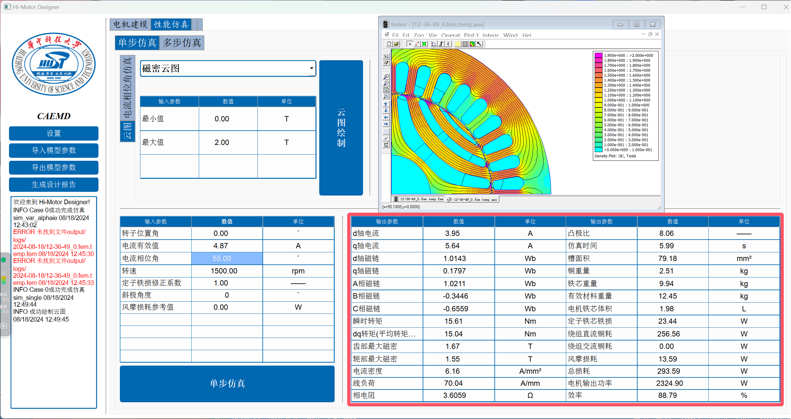

# 仿真计算

参考视频教程 [【Bilibili】Hi-Motor Designer 安装教程](https://www.待更新的网址.com/)

## 切换到性能仿真界面

## 单步仿真

### 计算最有电流相位角

1. 设定仿真参数

2. 开始电流相位角仿真

3. 得到最优电流相位角，右侧还可以查看电流仿真结果曲线

4. 在下方输入框内输入刚刚得到的最优电流相位角

5. 开始单步仿真

6. 查看仿真结果

数值结果

在这里切换不同仿真云图

## 多步仿真

### 转矩脉动仿真

1. 设定仿真参数

2. 开始转矩脉动仿真

3. 查看仿真结果

### 电机损耗仿真

1. 设定仿真参数

2. 开始电机损耗仿真

3. 查看仿真结果

数值结果

反电动势分布

