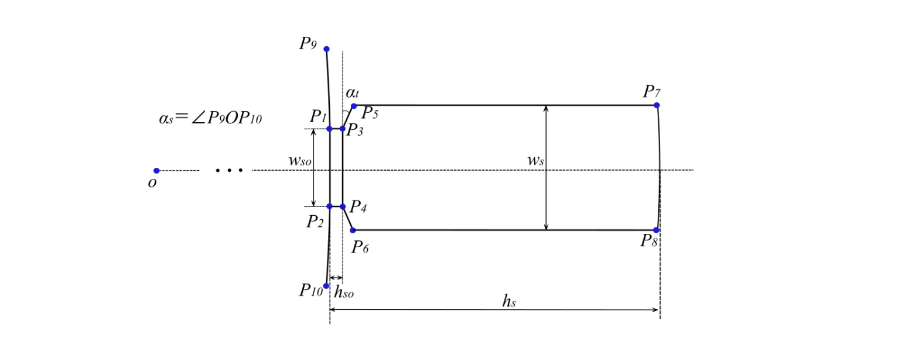
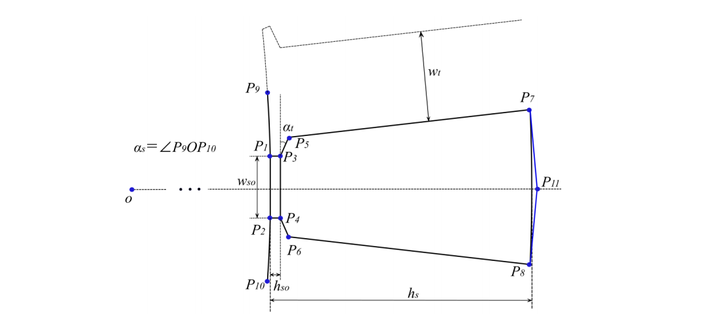
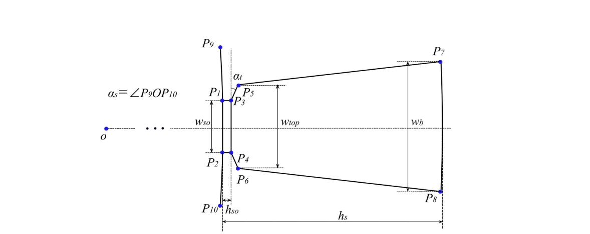

# 定子槽型

首先令单个定子槽的对称轴位于 x 轴，坐标原点位于电机几何中心 O，建立笛卡尔坐标系，令 x 轴为极坐标的角度坐标为 0° 的位置，建立相应的极坐标系。四种槽型的共同点为 $P_{1}$、$P_{2}$、$P_{3}$、$P_{4}$、$P_{9}$、$P_{10}$，如图 ${1-1}$、图 ${2-1}$、图 ${3-1}$ 所示。因此，在细分不同槽型之前，先求出这几个点的坐标。

对于 $P_{1}$ 点，极坐标系下，根据三角形三边关系，角度坐标为：

$$
\alpha_{P_{1}}=\arcsin \left(\frac{w_{s o}}{D_{i}}\right) \tag{0-1}
$$

式中，$w\_{so}$为定子槽开口宽度， $D_i$ 为定子内径。为叙述方便，正文中、图中的变量名称与代码的变量命名不统一，而是在表 ${1-4}$、表 ${2-9}$ 、表 ${3-3}$ 中将其一一对应。

$P_{1}$ 点位于定子内径上，因此其半径坐标为 $r_{P1} = \frac{D_i}{2}$。根据极坐标（r, α）与笛卡尔坐标（x, y）的转换关系：

$$
\left\{\begin{array}{l}
x=r \cdot \cos \alpha \\
y=r \cdot \sin \alpha
\end{array}\right. \tag{0-2}
$$

得到 $P1(x_{P1}, y_{P1})$。$P_{2}$ 与 $P_{1}$ 关于 x 轴对称，因此有 $P2(x_{P1}, -y_{P1})$。

对于 $P_{9}$ 点，极坐标系下，$P_{9}$ 点位于定子内径上，因此其半径坐标为 $r_{P9} = \frac{D_i}{2}$。∠P9OP10 为一个槽距角 $\alpha_s$，因此，P9 的角度坐标为二分之一个槽距角（槽距角在 Stator 类中已计算）。

进行坐标变换后得到 $P_{9}(x_{P_{9}}, y_{P_{9}})$。$P_{10}$ 与 $P_{9}$ 关于 x 轴对称，相应地得到 $P_{10}$ 点的位置。

将 $P_{1}$ 点和 $P_{2}$ 点分别沿 x 轴正方向平移齿肩部深度 $h_{so}$ 的距离，得到 $P_{3}$ 点和 $P_{4}$ 点。因此有 $P3(x_{P_{1}} + h_{so}, y_{P_{1}})$、$P_{4}(x_{P_{1}} + h_{so}, -y_{P_{1}})$。

$P_{1}P_{2}$ 与 $P_{3}P_{4}$ 为线段连接。$P_{9}P_{1}$ 与 $P_{2}P_{10}$ 为圆弧连接，圆心角各为齿距角的一半：

$$
 \alpha_{\widehat{P_{9}P_{1}}} = \alpha_{\widehat{P_{2}P_{10}}} = \frac{\alpha_{s}}{2} - \frac{\alpha_{P1}}{4} \tag{0-3}
$$

## 1. 定子平行槽

图${1-1}$   定子平行槽参数化模型示意图

表${1-1}$    定子平行槽变量名称对应表

| 参数名称         | 变量名称               | 文中标示   |
| ---------------- | ---------------------- | ---------- |
| 定子内径         | StatorInnerDiameter    | $D_i$      |
| 定子槽开口宽度   | StatorSlotOpening      | $w_{so}$   |
| 定子齿肩部角度   | StatorToothTipAngle    | $\alpha_t$ |
| 定子齿肩部深度   | StatorToothTipDepth    | $h_{so}$   |
| 定子槽深         | StatorSlotDepth        | $h_s$      |
| 定子槽底圆角半径 | StatorSlotCornerRadius | $r$        |
| 定子槽宽度       | StatorSlotWidthTop     | $w_s$      |

当定子槽型为平行槽时，$P_{5}$ 点的纵坐标 $y_{P_{5}}$ 为 $\frac{w_s}{2}$，其中，$w_s$ 为槽宽，代入式 ${2-1}$ 得到：

$$
 x_{P_{5}} = \frac{y_{P_{5}} - y_{P_{3}}}{\tan\left(\frac{\pi}{2} - \alpha_{t}\right)} - x_{P_{3}}  \tag{1-1}
$$

$P_{7}$ 点：

$$
\left\{
\begin{array}{l}
x_{P_{7}} = \frac{D_{i}}{2} + h_{s} \\
y_{P_{7}} = y_{P_{5}}
\end{array}
\right. 
\tag{1-2}
$$

$P_{8}$ 与 $P_{7}$ 关于 x 轴对称，相应地得到 $P_{8}$ 点的位置。$P_{3}P_{5}$、$P_{5}P_{7}$、$P_{7}P_{8}$、$P_{4}P_{6}$、$P_{6}P_{8}$ 为线段连接。

选中单个槽的模型，绕圆心 O 点旋转半个槽距角，并进行阵列操作，得到 Qsim 个槽的模型。对于定子全模型，添加外边界条件至 FEMM，画出定子外径整圆，赋以外边界。对于定子一对极或单极模型，根据极对数和仿真区域变量画出定子外径圆弧，画出侧边界线段，并添加边界条件，对于一对极模型，边界条件为周期边界，对于单极模型，边界条件为反周期边界。

最后在相应位置赋材料。在定子外径圆弧的对称轴线上，选择轭部中间的位置赋以铁芯材料。对每个槽口赋空气材料。若导体类型为扁线，对每个槽、槽内所有导体赋以绕组材料，赋材料位置在扁线导体的几何中心，并添加电流激励，对槽绝缘赋空气材料，若导体类型为圆线，对每个槽赋以绕组材料，并添加电流激励，赋材料位置在槽的几何中心。

## 2. 定子平行齿

图${2-1}$   定子平行齿参数化模型示意图

表${2-1}$   定子平行齿变量名称对应表

| 参数名称         | 变量名称               | 文中标示   |
| ---------------- | ---------------------- | ---------- |
| 定子内径         | StatorInnerDiameter    | $D_i$      |
| 定子槽开口宽度   | StatorSlotOpening      | $w_{so}$   |
| 定子齿肩部角度   | StatorToothTipAngle    | $\alpha_t$ |
| 定子齿肩部深度   | StatorToothTipDepth    | $h_{so}$   |
| 定子槽深         | StatorSlotDepth        | $h_s$      |
| 定子槽底圆角半径 | StatorSlotCornerRadius | $r$        |

| 定子齿宽度（平行齿）

下面介绍平行齿圆底槽的模型建立过程。直线 $P_{3}P_{5}$ 过点 $P_{3}$，斜率由齿肩部角度 $\alpha_t$ 得到，可以列出其直线方程：

$$
y_{P_{3}} - y_{P_{5}} = \tan\left(\frac{\pi}{2} - \alpha_t\right) \times (x_{P_{5}} - x_{P_{3}})  
\tag{2-1}
$$

根据平行齿的特性，单个齿的对称轴过圆心 O，且斜率 $k = \tan\left(\frac{\alpha_s}{2}\right)$，直线 $P_{5}P_{7}$ 由齿的对称轴平移二分之一个齿宽 $w_t$，得到该直线与 y 轴交点的纵坐标 $b = -\frac{w_t}{2} \times \cos\left(\frac{\alpha_s}{2}\right)$，可以用 $y = kx + b$ 的形式列出其直线方程：

$$
y = \tan\left(\frac{\alpha_s}{2}\right) \times x + \left(-\frac{w_t}{2} \times \cos\left(\frac{\alpha_s}{2}\right)\right)  
\tag{2-2}
$$

直线 $P_{3}P_{5}$ 与直线 $P_{5}P_{7}$ 相交于 $P_{5}$ 点，联立式 ${2-1} 与式 {2-2}$ 得到：

$$
\begin{cases} y_{P_{5}} = \tan\left(\frac{\pi}{2} - \alpha_t\right) \times (x_{P_{5}} - x_{P_{3}}) + y_{P_{3}} \\ y_{P_{5}} = \tan\left(\frac{\alpha_s}{2}\right) \times x_{P\_{5}} + \left(-\frac{w_t}{2} \times \cos\left(\frac{\alpha_s}{2}\right)\right) \end{cases}  \tag{2-3}
$$

$P_{7}$ 点位于以 O 点为圆心，以 $\frac{D_i}{2} + h_s$ 为半径的圆上，其中，$h_s$ 为槽深，圆方程为：

$$
x^2 + y^2 = \left(\frac{D_i}{2} + h_s\right)^2  \tag{2-4}
$$

联立式 ${2-2} 与式 {2-4}$ 得到：

$$
\begin{cases} x_{P_{7}}^2 + \left(y_{P_{7}} - \frac{w_t}{2} \times \cos\left(\frac{\alpha_s}{2}\right)\right)^2 = \left(\frac{D_i}{2} + h_s\right)^2 \\ y_{P_{7}} = \tan\left(\frac{\alpha_s}{2}\right) \times x_{P_{7}} + \left(-\frac{w_t}{2} \times \cos\left(\frac{\alpha_s}{2}\right)\right) \end{cases}  \tag{2-5}
$$

$P_{6}$ 点、$P_{8}$ 点分别与 $P_{5}$ 点、$P_{7}$ 点关于 x 轴对称，因此有 $P_{6}(x_{P_{5}}, -y_{P_{5}})$、$P_{8}(x_{P_{7}}, -y_{P_{7}})$。

当定子槽型为平行齿圆底槽时，$P_{11}$ 点为以 O 点为圆心、以 $\frac{D_i}{2} + h_s$ 为半径的圆和 x 轴的交点，$P_{7}P_{8}$ 为圆弧连接，圆心为 O 点，FEMM 中创建圆弧需要圆心角，弧 $P_{7}P_{8}$ 的圆心角为：

$$ 
s\alpha_{P_{7}P_{8}} = 2 \times \arctan\left(\frac{y_{P_{8}} - y_{P_{7}}}{x_{P_{8}} - x_{P_{7}}}\right)  \tag{2-6}
$$

$P_{3}P_{5}$、$P_{5}P_{7}$、$P_{4}P_{6}$、$P_{6}P_{8}$ 为线段连接。另外，可以在 $P_{7}$ 点、$P_{8}$ 点处添加半径为 $r$ 的倒角，并对新建的倒角添加群组。至此完成单个槽的平行齿圆底槽参数化建模。

当定子槽型为平行齿方底槽时，直线 $P_{7}P_{11}$ 与直线 $P_{5}P_{7}$ 垂直，因此，$P_{11}$ 的坐标：
$$ 
\begin{cases} x_{P_{11}} = x_{P_{7}} + \tan\left(\frac{\alpha_s}{2}\right) \times y_{P_{7}} \\ y_{P\_{1}1} = 0 \end{cases} \tag{2-7}
$$
$P_{7}P_{11}、P_{11}P_{8}$ 为线段连接。至此完成单个槽的平行齿方底槽参数化建模。

## 3. 定子锥形槽

图${3-1}$定子锥形槽参数化模型示意图

表${3-1}$定子锥形槽变量名称对应表

| 参数名称                 | 变量名称               | 文中标示   |
| ------------------------ | ---------------------- | ---------- |
| 定子内径                 | StatorInnerDiameter    | $D_i$      |
| 定子槽开口宽度           | StatorSlotOpening      | $w_{so}$   |
| 定子齿肩部角度           | StatorToothTipAngle    | $\alpha_t$ |
| 定子齿肩部深度           | StatorToothTipDepth    | $h_{so}$   |
| 定子槽深                 | StatorSlotDepth        | $h_s$      |
| 定子槽底圆角半径         | StatorSlotCornerRadius | $r$        |
| 定子槽顶部宽度（锥形槽） | StatorSlotWidthTop     | $w_{top}$  |
| 定子槽底部宽度（锥形槽） | StatorSlotWidthBottom  | $w_b$      |

当定子槽型为锥形槽时，$P_{5}$ 点的纵坐标 $y_{P_{5}}$ 为 $\frac{w_{top}}{2}$，其中，$w_s$ 为槽宽，利用式${1-1}$得到 $P_{5}$ 点的横坐标。$P_{6}$ 与 $P_{5}$ 关于 x 轴对称，相应地得到 $P_{6}$ 点的位置。$P_{7}$ 点的纵坐标 $y_{P_{7}}$ 为 $\frac{w_b}{2}$，且 $P_{7}$ 点位于以 O 点为圆心，以 $\frac{D_i}{2} + h_s$ 为半径的圆上，因此，$P_{7}$ 点的横坐标：

$$
x_{P_{7}} = \sqrt{\left(\frac{D_i}{2} + h_s\right)^2 - y_{P_{7}}^2} \tag{3-1}
$$

$P_{8}$ 与 $P_{7}$ 关于 x 轴对称，相应地得到 $P_{8}$ 点的位置。$P_{3}P_{5}、P_{5}P_{7}、P_{4}P_{6}、P_{6}P_{8}$ 为线段连接。$P_{7}P_{8}$ 为圆弧连接，圆心为 O 点，弧 $P_{7}P_{8}$ 的圆心角参考式${2-6}$。另外，可以在 $P_{7}$ 点、$P_{8}$ 点处添加半径为 $r$ 的倒角，并对新建的倒角添加群组。至此完成单个槽的锥形槽参数化建模。

选中单个槽的模型，绕圆心 O 点旋转半个槽距角，并进行阵列操作，得到 Qsim 个槽的模型。对于定子全模型，添加外边界条件至 FEMM，画出定子外径整圆，赋以外边界。对于定子一对极或单极模型，根据极对数和仿真区域变量画出定子外径圆弧，画出侧边界线段，并添加边界条件，对于一对极模型，边界条件为周期边界，对于单极模型，边界条件为反周期边界。

最后在相应位置赋材料。在定子外径圆弧的对称轴线上，选择轭部中间的位置赋以铁芯材料。对每个槽口赋空气材料。若导体类型为扁线，对每个槽、槽内所有导体赋以绕组材料，赋材料位置在扁线导体的几何中心，并添加电流激励，对槽绝缘赋空气材料，若导体类型为圆线，对每个槽赋以绕组材料，并添加电流激励，赋材料位置在槽的几何中心。