# 快速开始
参考视频教程 [【Bilibili】Hi-Motor Designer 安装教程](https://www.bilibili.com/video/BV18bYueDEwo/)

## 获取安装包
目前有以下两种获取方式：
1. 从[下载页面](/download)获取。
2. 联系开发团队，Email:[ hi.motor.cn@gmail.com](mailto: hi.motor.cn@gmail.com)

## 安装 Hi-Motor Designer
安装包命名方式 `HMD-<版本号>-Setup.exe`, 0.5.0 版本安装包如下图：

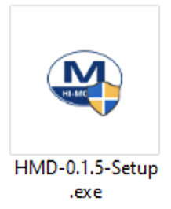

1. 点击安装包，同意以管理员权限运行。

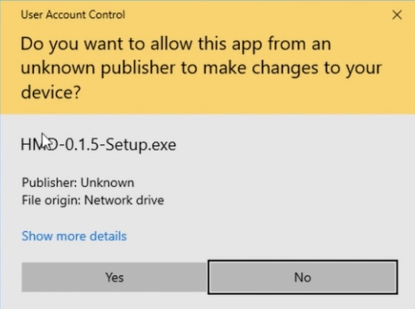

2. 点击 Next 同意用户协议
<table><tr>
<td>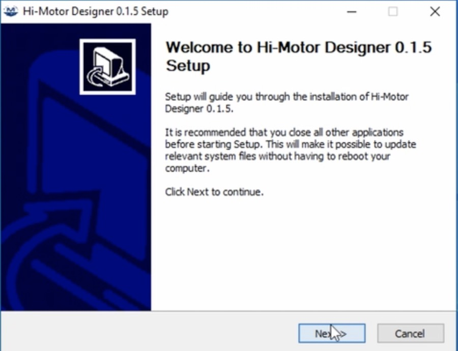</td>
<td>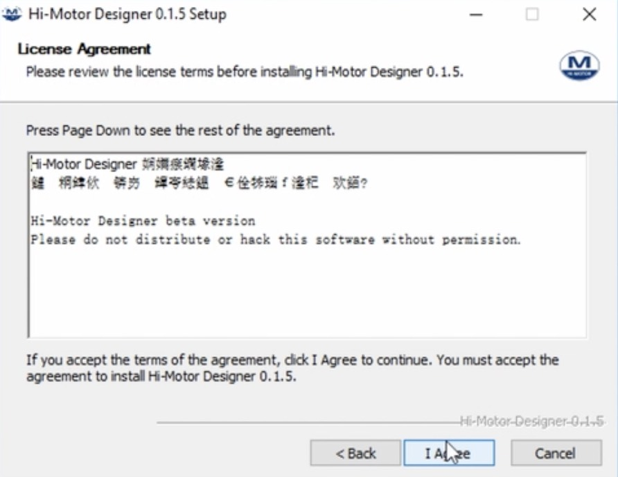</td>
</tr></table>

3. 选择程序安装位置，建议安装在用户目录下(`c:\Users\<你的用户名>\` 或 `c:\用户\<你的用户名>\`)。 
安装在系统默认目录(`c:\Program Files\` 或 `c:\Program Files(x86)\`等)下时，此后每次打开程序都需要管理员权限，否则会出现读写权限不足的问题。

4. 选择 Start Menu 安装文件名（这个选项不重要）。

<table><tr>
<td>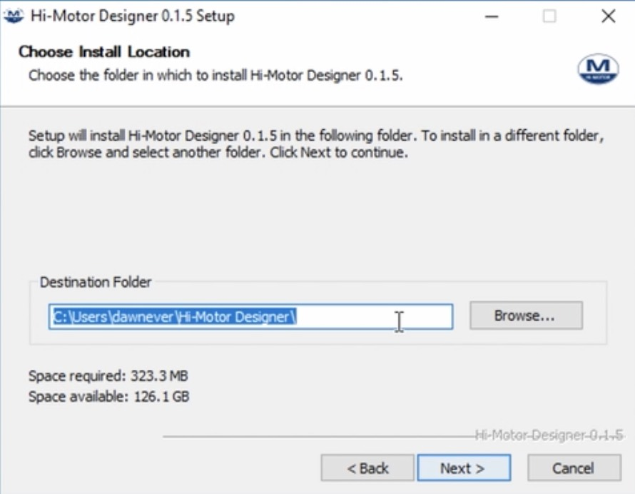</td>
<td>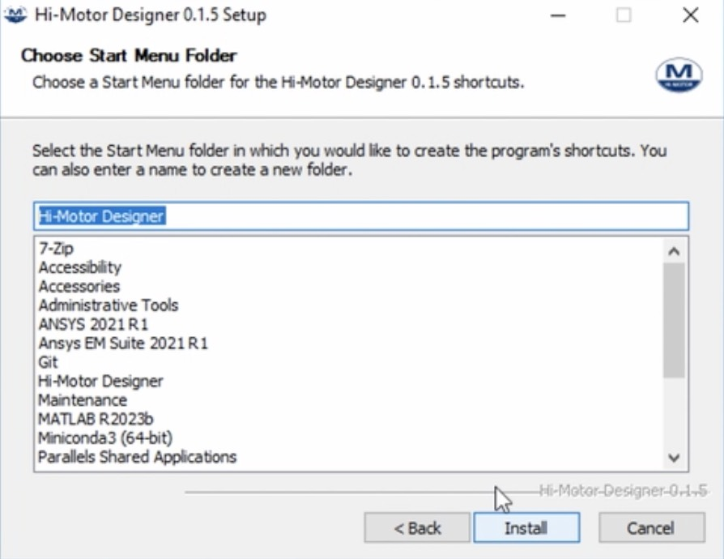</td>
</tr></table>

5. 经历略有些漫长的解压安装过程（约 1 分钟，受计算机配置影响）。 
在解压结束后，提示安装依赖工具依赖 Femm。 
选择 Yes 会启动浏览器打开 Femm 官方下载页面[www.femm.info/wiki/Download](https://www.femm.info/wiki/Download)。 
***注意！Femm 是本软件运行必要的开源工具依赖。***

<table><tr>
<td>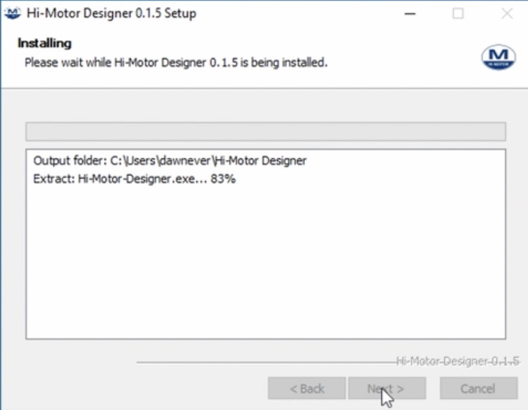</td>
<td>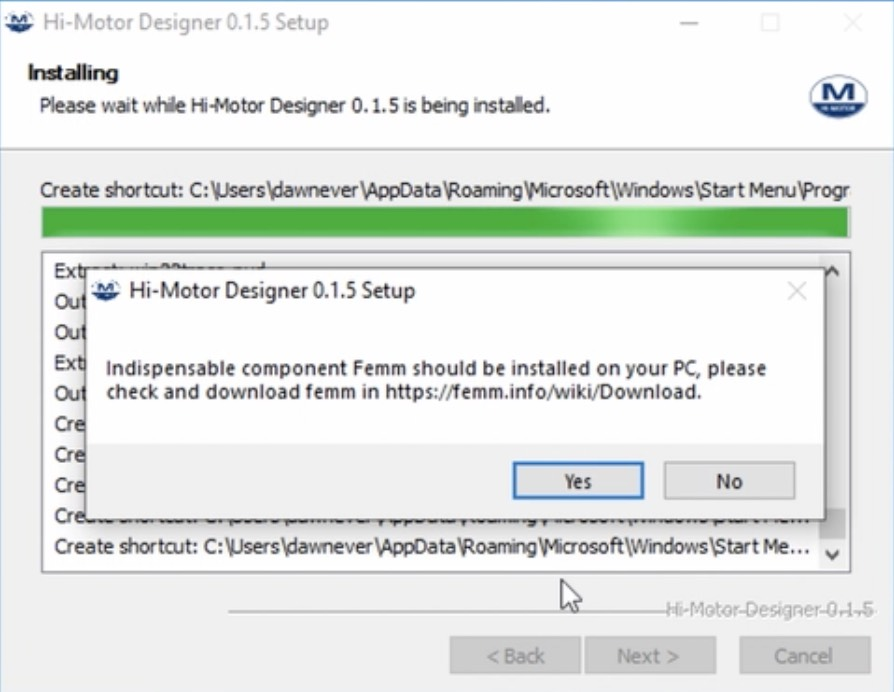</td>
</tr></table>

6. 点击 `完成` 或 `Finish` 完成安装。

7. 完成安装后，桌面会出现 `Hi-Motor Designer` 快捷方式如下图：
<table><tr>
<td>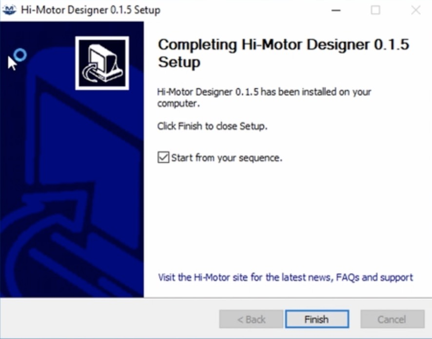</td>
<td>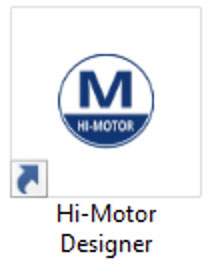</td>
</tr></table>

## 安装 Femm
下载 Femm 安装包，点击`下一步`安装即可。

## 软件初始化和证书验证(试用版不需要这个环节)
1. 首次点击 `Hi-Motor Designer` 会启动软件初始化。 
在安装路径下 `src` 文件夹下创建并初始化 `local` 本地数据文件夹。
<table><tr>
<td>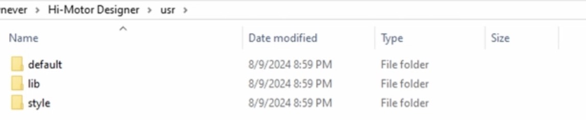</td>
<td>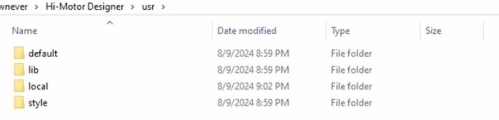</td>
</tr></table>

2. 进入 `src/local` 目录下，使用`记事本`或其他文本编辑工具打开 sequence.key 序列号文件（`src/local/sequence.key`），在引号中填入序列号。 
注意，序列号需要联网激活（仅首次激活需要联网）。 
序列号在激活后将绑定计算机相关用户信息，一条序列号仅可以用于一台计算机使用。 
可通过访问 [license.hi-motor.site](https://license.hi-motor.site/query) 查询序列号激活信息。 
<table><tr>
<td>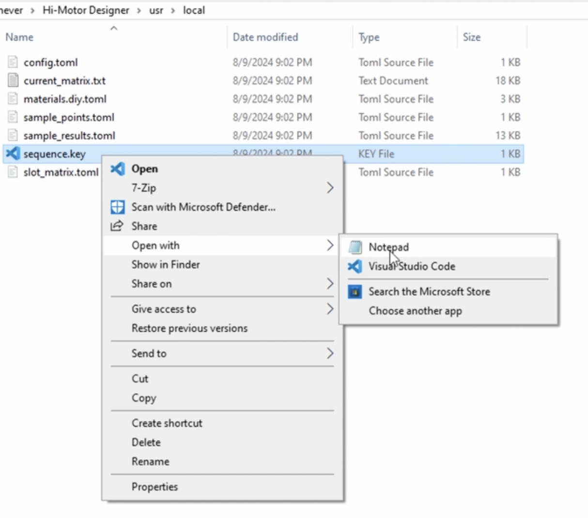</td>
<td>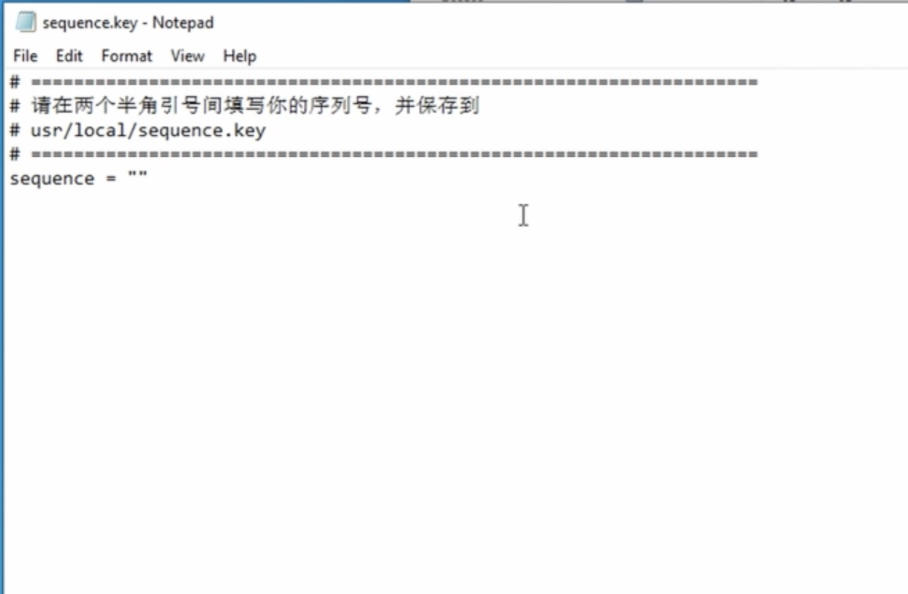</td>
</tr></table>

3. 完成后，再次点击 `Hi-Motor Designer` 即可启动软件。

## 卸载软件
右击 `Hi-Motor Designer` 快捷方式 选择`卸载`即可。

## Q&A
遇到问题或发现错误请参照`常见问题`页面或联系开发者。