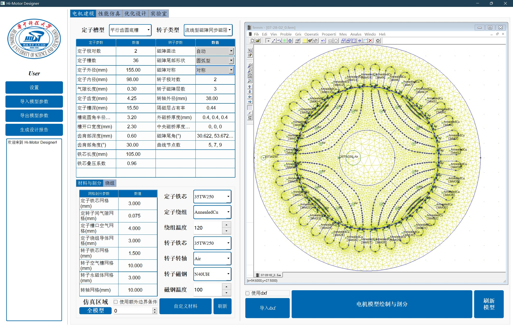
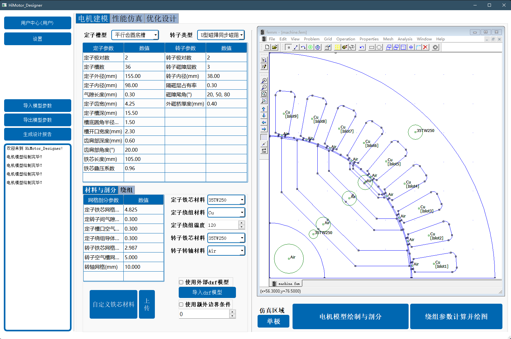
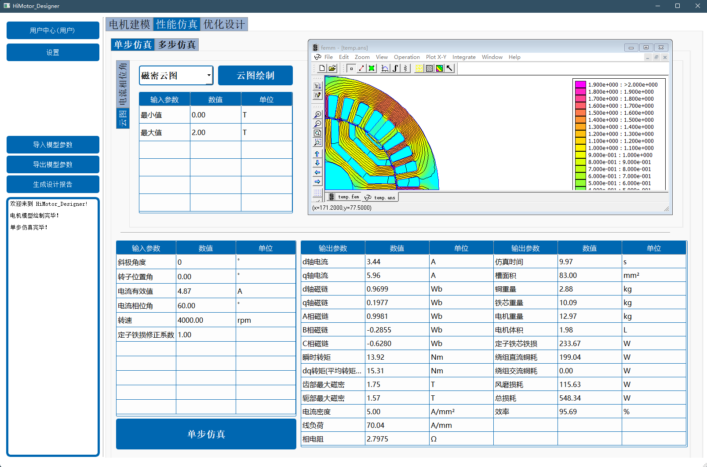
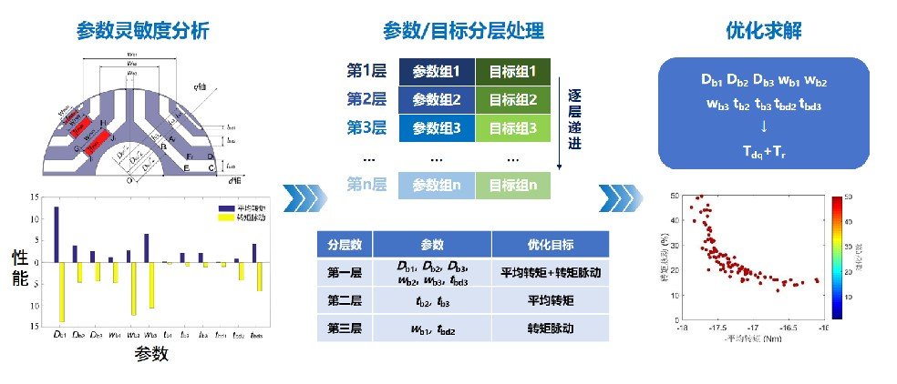
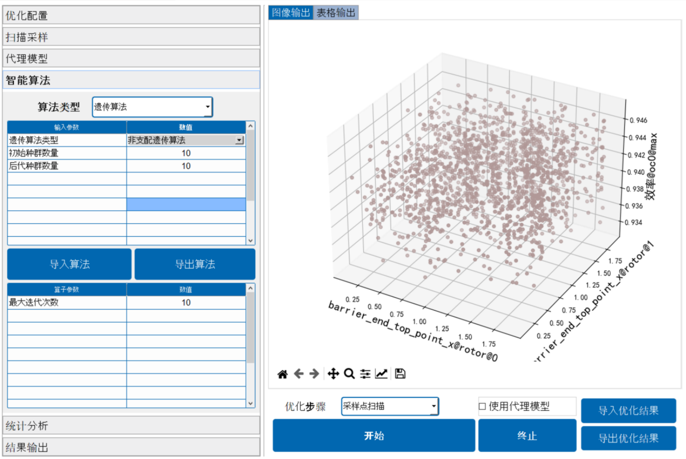
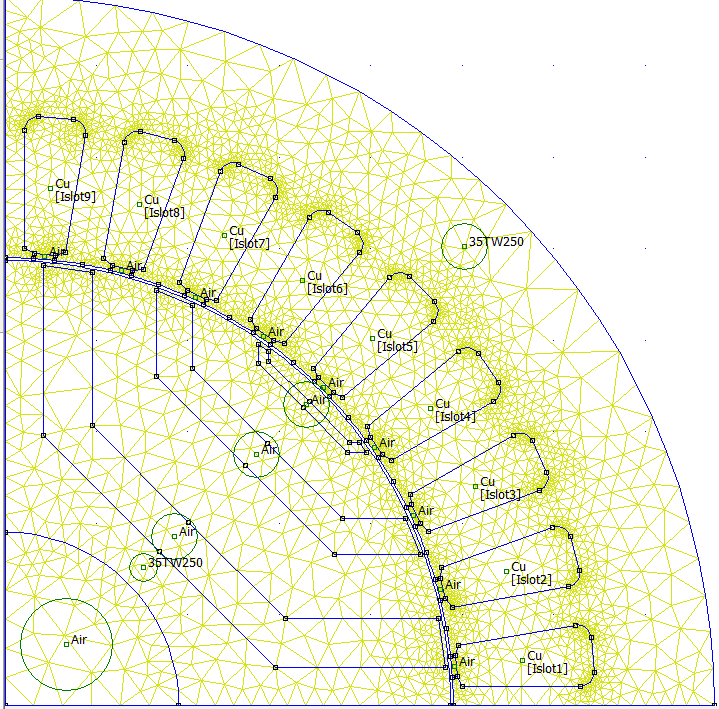
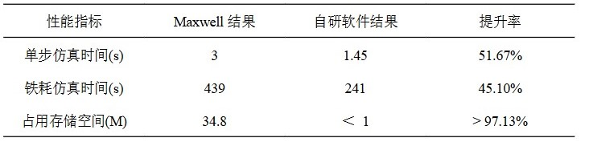

# 什么是 Hi-Motor Designer
## 什么是 Hi-Motor？
*Hi-Motor Designer*，是一款由 Hi-Motor 团队独立研发的一款国产高效电机设计优化工业软件。项目依托华中科技大学创新电机研究中心十年技术积累，立足产业实际需求，为用户提供高效电机建模、仿真、优化全流程、一站式服务。 
<table><tr>
<td></td>
</tr></table>

*Hi-Motor Designer*，正如其名， *Design of High Performance Motor*，本产品正是为高效电机设计优化而生；又意为 *Hi, Motor Design*，我们的目标是让电机设计不再困难！ 

## Hi-Motor Designer 能做什么？
*Hi-Motor Designer*，是一款针对电机设计的创新软件。通过使用Python语言，实现同步磁阻电机参数化建模； 

<table><tr>
<td></td>
</tr></table>

基于开源工具FEMM，实现电机电流相位角仿真等多种仿真模式； 
<table><tr>
<td></td>
</tr></table>

结合差分进化算法等多种高效智能算法，实现电机多目标优化设计和分层优化。 
<table><tr>
<td></td>
</tr></table>

同时，*Hi-Motor Designer* 还具备高效电机智能优化设计平台，通过参数化建模和多目标优化设计等功能，实现了从用户需求到高效电机的转化，解决了电机设计复杂和优化困难的问题。 
<table><tr>
<td></td>
</tr></table>

*Hi-Motor Designer*的出现，将为电机行业的发展带来新的机遇和挑战。
## Hi-Motor Designer 的优势是什么？

### 轻量化
我们的软件相比其他商业软件站用内存更小，可以在个人笔记本上面运行，ansys maxwell占用内存23G，JMAG占用内存11G，*Hi-Motor Designer*占用内存仅800M，能在个人电脑上面流畅运行。

### 快
以一36槽4极电机为例，本软件得到的电机总损耗、负载转矩等主要电机性能指标与商业有限元软件Maxwell相比，误差范围均在1%以内，仿真速度明显优于商业有限元软件。
示例电机如图所示 
<table><tr>
<td></td>
</tr></table>

仿真性能对比如下
<table><tr>
<td></td>
</tr></table>

计算速度的到了很大的提升